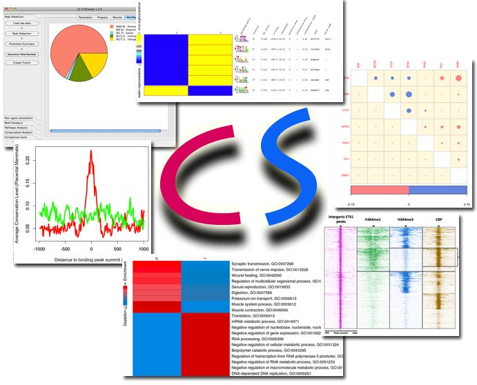

# ChIPseeqer (v2.0)

ChIPseeqer is a computational framework for the analysis of ChIP-seq datasets.

It includes quality control tools for the raw data and peak detection.

Moreover, it offers:

1. Gene-level annotation of peaks
2. Pathways enrichment analysis
3. Regulatory element analysis, using either a de novo approach, known or user-defined motifs
4. Nongenic peak annotation (repeats, CpG islands, duplications)
5. Conservation analysis
6. Clustering analysis
7. Visualization
8. Integration and comparison across different ChIP-seq experiments

## License

ChIPseeqer is open-source software, released under the
GNU GENERAL PUBLIC LICENSE v.3. For more information,
please see the file called LICENSE.

## Download

Annotation data are available at:

[http://physiology.med.cornell.edu/faculty/elemento/lab/CS_files/](http://physiology.med.cornell.edu/faculty/elemento/lab/CS_files/)

## Installation

For installation instructions please take a look at the file called [INSTALL](docs/).

## Documentation

ChIPseeqer is fully documented online at:

[https://physiology.med.cornell.edu/faculty/elemento/lab/chipseq.shtml](https://physiology.med.cornell.edu/faculty/elemento/lab/chipseq.shtml)

## Authors

The ChIPseeqer software has been developed in the [Elemento lab](http://physiology.med.cornell.edu/faculty/elemento/lab/), at the Institute of Computational Biology of Weill Cornell Medical College, by:

- Eugenia Giannopoulou, Ph.D. ([eug2002@med.cornell.edu](mailto:eug2002@med.cornell.edu))
- Olivier Elemento, Ph.D. ([ole2001@med.cornell.edu](mailto:ole2001@med.cornell.edu))

## Contact

If you have any questions, bug reports or features suggestions please contact:

- Eugenia Giannopoulou, Ph.D. ([eug2002@med.cornell.edu](mailto:eug2002@med.cornell.edu))
